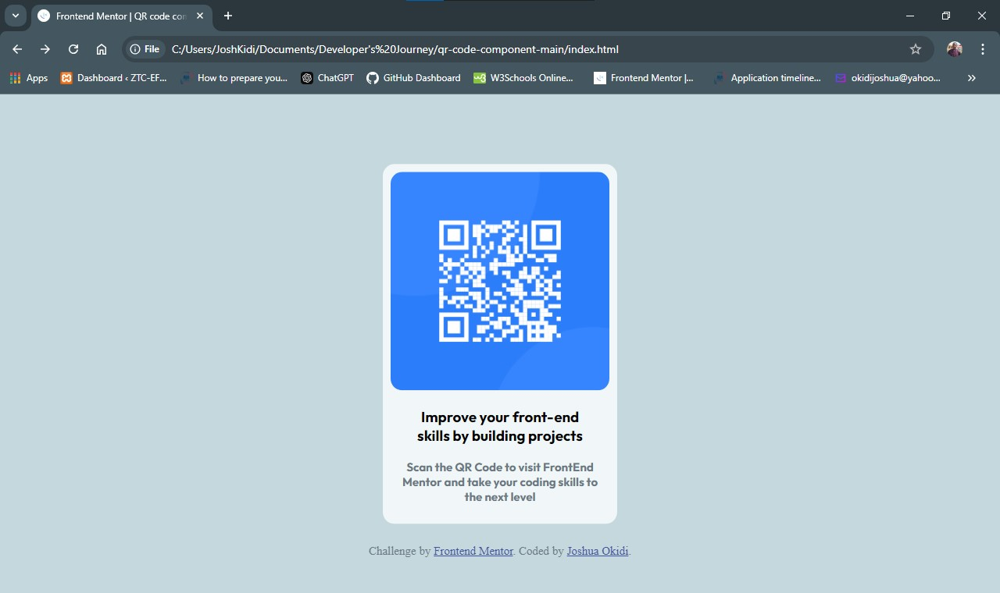
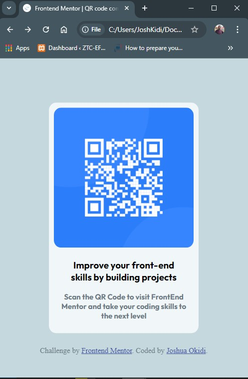

# Frontend Mentor - QR code component solution

This is a solution to the [QR code component challenge on Frontend Mentor](https://www.frontendmentor.io/challenges/qr-code-component-iux_sIO_H). Frontend Mentor challenges help you improve your coding skills by building realistic projects. 

## Table of contents

- [Overview](#overview)
  - [Screenshot](#screenshot)
  - [Links](#links)
- [My process](#my-process)
  - [Built with](#built-with)
  - [What I learned](#what-i-learned)
  - [Continued development](#continued-development)
  - [Useful resources](#useful-resources)
- [Author](#author)
- [Acknowledgments](#acknowledgments)

**Note: Delete this note and update the table of contents based on what sections you keep.**

## Overview

### Screenshot
Here is the Screenshot of the desktop view on my System.


My Mobile view of the solution:


**Note: Delete this note and the paragraphs above when you add your screenshot. If you prefer not to add a screenshot, feel free to remove this entire section.**

### Links

- Solution URL: [Add solution URL here](https://your-solution-url.com)
- Live Site URL: [Add live site URL here](https://your-live-site-url.com)

## My process
-Steps I took;
  - Built the Structure and included the image
  - Styled the html structure using CSS
  - It was really difficult for me to centralize the QR code and it's surrounding box.
  - Similarly, a very tough phase I went through was how to make the QR Image shrink alongside the Box.
  - From w3schools, under CSS shadow effects, I was able to add shadow box to my div.
  - 

**Note: Using just HTML and CSS, how do I make this image remain in the middle with the box at different viewports? A very important thing I learnt**
### Built with

- Semantic HTML5 markup
- CSS custom properties
- Flexbox
- CSS Grid

### What I learned

Use this section to recap over some of your major learnings while working through this project. Writing these out and providing code samples of areas you want to highlight is a great way to reinforce your own knowledge.
I learnt on centralizing a div vertically.
I got more familiar with how the CSS[max-width, and width] work.
I was able to set a border around the image particularly using the third css code below.
I made the code as minimal as possible.

My important code snippets below:

```html
<h1>Some HTML code I'm proud of</h1>
```
```css
.proud-of-this-css {
   transform: translate(0, 50%);
}
#container img {
  width: 100%;
  } 
img {
  border-radius: 15px;
}
```

**Help in writing markdown, I have to visit [The Markdown Guide](https://www.markdownguide.org/) to learn more.**

### Continued development

I'd love to improve on the use of flexboxes, making the webpage more interactive and responsive on different devices.
I look forward to integrating Javascript into the this next time.

### Useful resources

- [w3Schools](https://www.w3schools.com) - This helped me for XYZ reason. I really liked this pattern and will use it going forward.
- [Hubspot](https://blog.hubspot.com/websit/center-div-css) - This is an amazing article which helped me finally understand how to center my QR Code container vertically. I'd recommend it to anyone still learning this concept.
- [Codedamn](https://codedamn.com/news/frontend/how-to-center-a-div-text-and-more-with-css) - This made it really easier for me to keep the entire work in the middle of the page.


## Author

- Website - [Joshua Okidi](https://www.your-site.com)
- Frontend Mentor - [@Joshua-Okid](https://www.frontendmentor.io/profile/joshuaokidi)
- X - [@JoshOkidi](https://x.com/JoshOkidi)


## Acknowledgments

A big thank you to W3Schools for being my No.1 goto site for help and enquiries.
Thank you frontend Mentor for this simple but meaningful challenge. Now I know where to improve on next time.